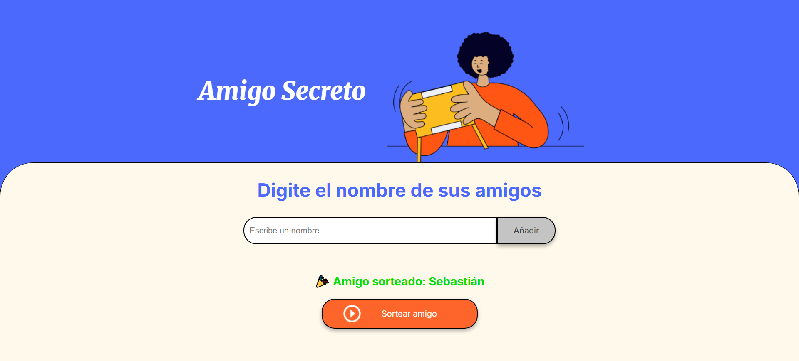

# 🎁 Amigo Secreto

¡Bienvenido a **Amigo Secreto**! 🎉 Un sencillo pero divertido proyecto para gestionar y sortear nombres en un juego de amigo secreto. Perfecto para reuniones, fiestas y eventos especiales. 🥳

## 🚀 Características

- 📌 Agrega nombres de amigos a la lista.
- 📜 Visualiza los participantes en tiempo real.
- 🎲 Sortea aleatoriamente un ganador.
- 🧹 Limpia la lista tras el sorteo para una mejor experiencia.

## 🛠️ Tecnologías utilizadas

- **HTML5** 🏗️ – Para la estructura del proyecto.
- **CSS3** 🎨 – Para darle un diseño atractivo.
- **JavaScript** ⚡ – Para la funcionalidad interactiva.

## 📸 Vista previa



## 📂 Estructura del proyecto

```
📂 amigo-secreto/
├── 📄 index.html      # Página principal
├── 🎨 style.css       # Estilos del proyecto
├── ⚡ app.js          # Lógica en JavaScript
└── 📂 assets/        # Imágenes y recursos
```

## 🔧 Instalación y uso

1. **Clona el repositorio:**
   ```sh
   git clone https://github.com/tuusuario/amigo-secreto.git
   ```
2. **Abre el archivo `index.html` en tu navegador** y ¡listo! 🎉

## 🎯 Cómo jugar

1. **Ingresa los nombres** de los participantes.
2. **Presiona "Añadir"** para agregarlos a la lista.
3. **Haz clic en "Sortear amigo"** para seleccionar un ganador.
4. **¡Disfruta del juego!** 😄

## 📜 Licencia

Este proyecto está bajo la licencia **MIT**, lo que significa que puedes modificarlo y compartirlo libremente. 🔥

---

💡 _¿Ideas para mejorar? ¡Siéntete libre de contribuir!_ ✨
